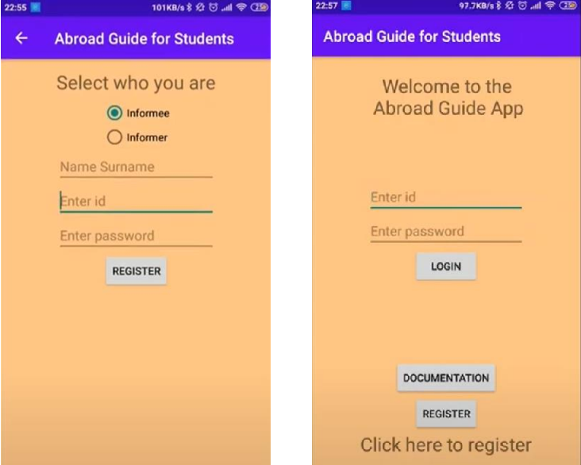
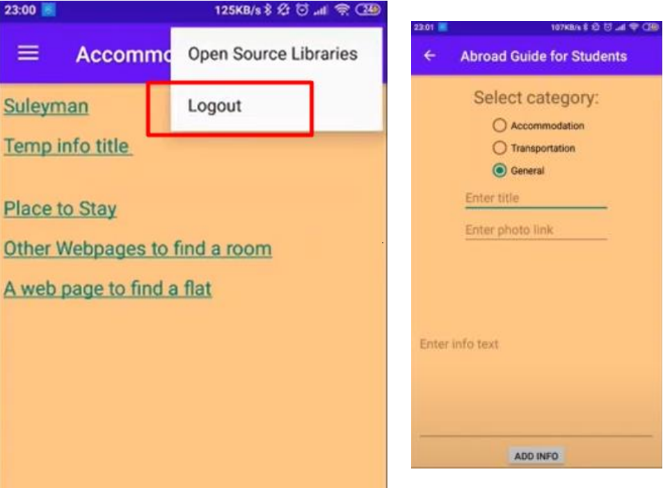
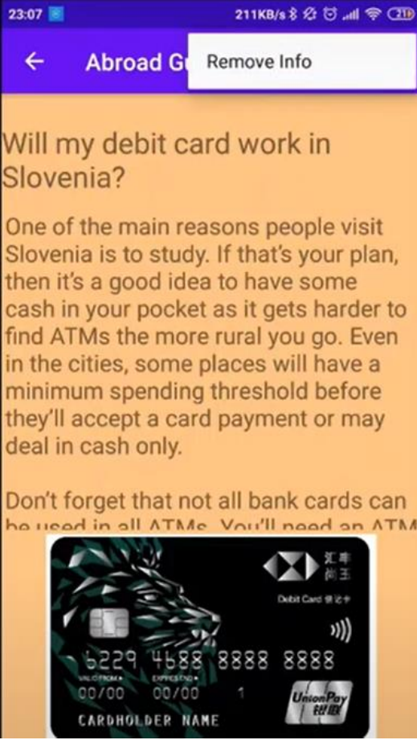

# Abroad-Guide-for-Students
Abroad Guide for Students

In the world, many students go abroad with opportunities like Erasmus+. But they don't know anything about the country they are going.
Every school doesn't offer staying place in student dormitories for every student. Lack of information about this can make student cancel the Erasmus programme. But information system that will help people to students will help about the accommodation. It will show links and websites to find available accommodations.
People who are not coming from EU countries have another problem: Mobile operator.

There is something called Roaming which allows you to use internet/call in other countries but it's really expensive for people who are not coming from EU. So, people need to buy SIM card. Also, it's not just that. Some countries don't allow to use a SIM card without tax number. To get tax number, first you need to take an appointment from Administrative Unit. And submit so many papers to get this number. Application also will help people to learn information about these problems.
Another problem is Transportation.

In the world, there are some countries that you cannot get on the bus without bus-card. They don't allow you to use coins. So, you need to buy a bus card. Also, to use student discounts you may need to take an appointment in somewhere to buy this card. In a country that you are first time in, it might be difficult to find place to buy a student card.
Also you may want to learn bus hours, taxi hours, bus itinerary, bus stops, loading money on the card online. So application will have a link for other bus guide applications. 

## How to Install?

- You can install the apk file from the link below.
` https://drive.google.com/file/d/1ocu57B_D2UcehCQ8i36foHXeegkfEsAW/view?usp=sharing`

## Example Images from Application

